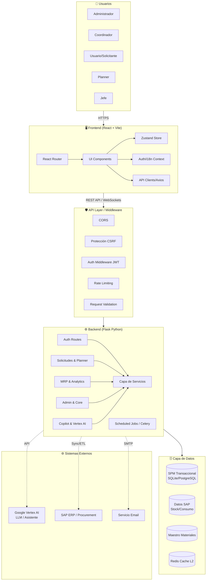
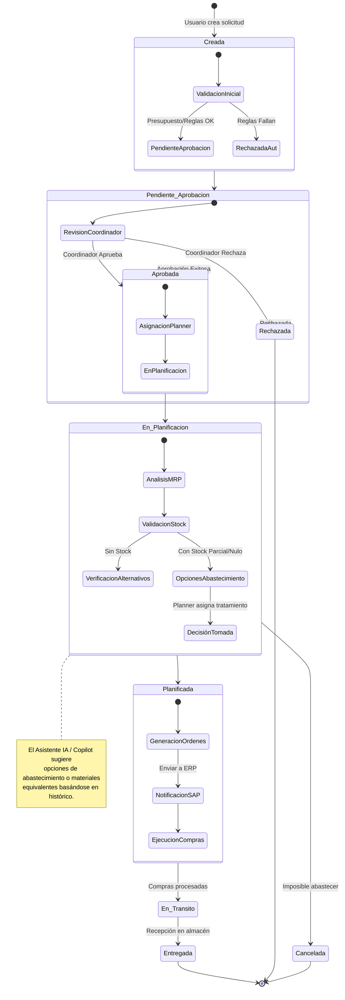
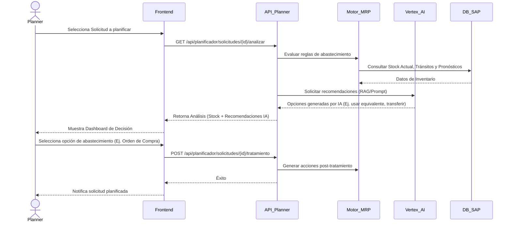
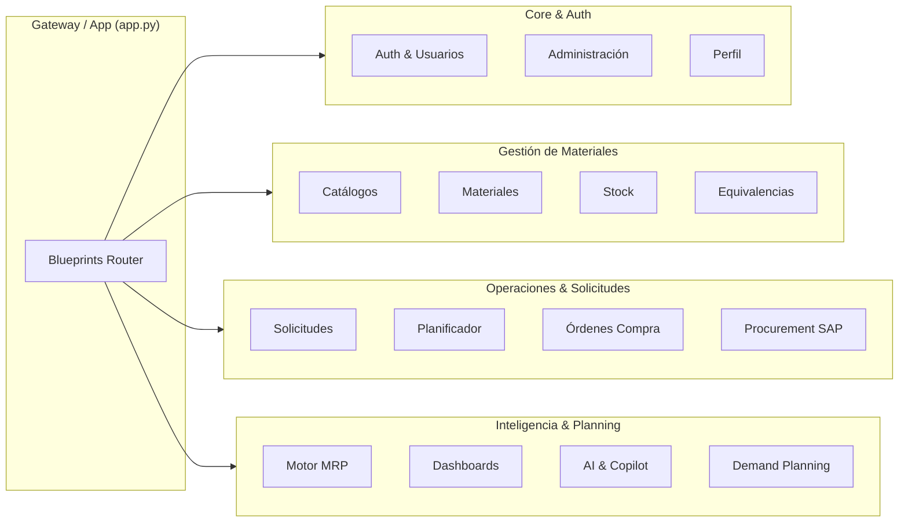

# SPM v3.0 - Arquitectura y Flujo de Sistema

Este documento describe la arquitectura y los flujos principales del Sistema de Planificación de Materiales (SPM v3.0).

## 1. Arquitectura de Alto Nivel

El sistema sigue una arquitectura cliente-servidor con un frontend en React (SPA) y un backend en Flask que expone una API REST. Se integra con múltiples bases de datos y servicios externos (SAP, Vertex AI).

## 2. Flujo Principal: Ciclo de Vida de una Solicitud de Material

Este es el flujo central del sistema, que abarca desde que un usuario solicita un material hasta su planificación y entrega.

## 3. Arquitectura del Flujo de Planificación y AI (Copilot / MRP)

El motor de MRP (Material Requirements Planning) y el Copilot de IA son piezas fundamentales para asistir al Planner.

## 4. Estructura de Módulos (Backend Blueprints)

El backend está organizado en múltiples dominios funcionales (Blueprints):

